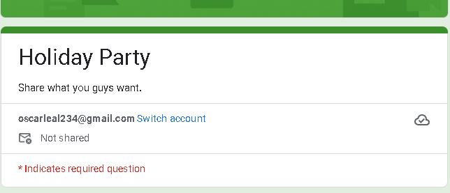
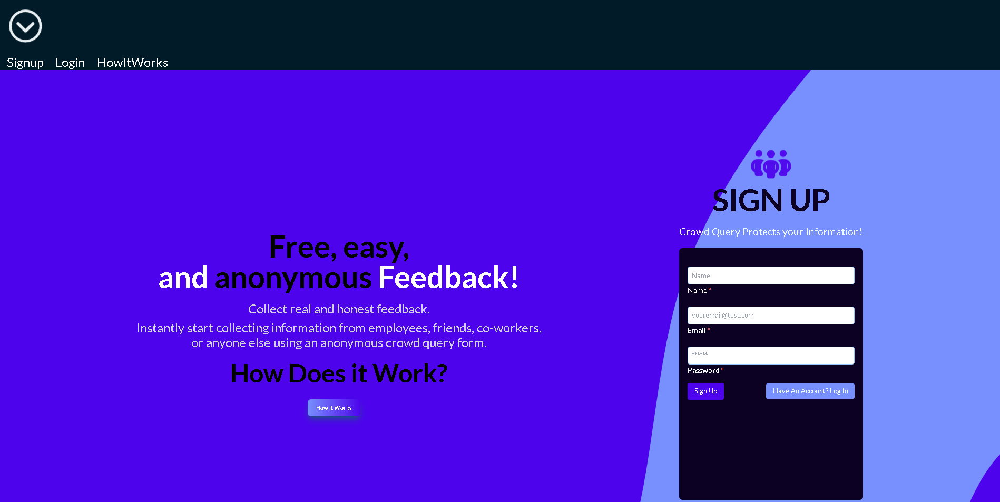
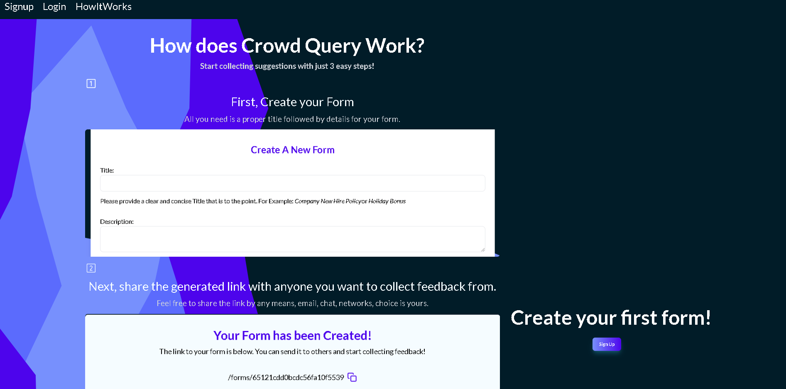
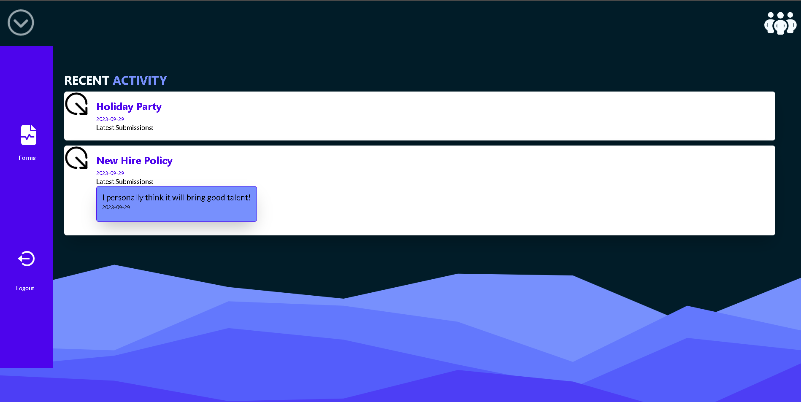
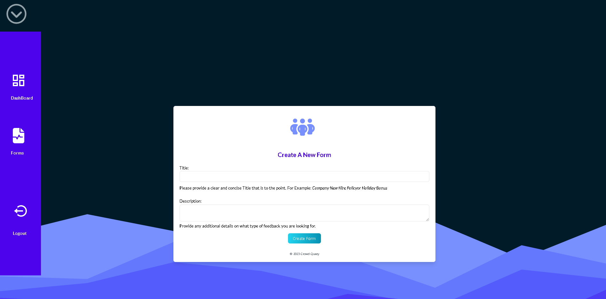
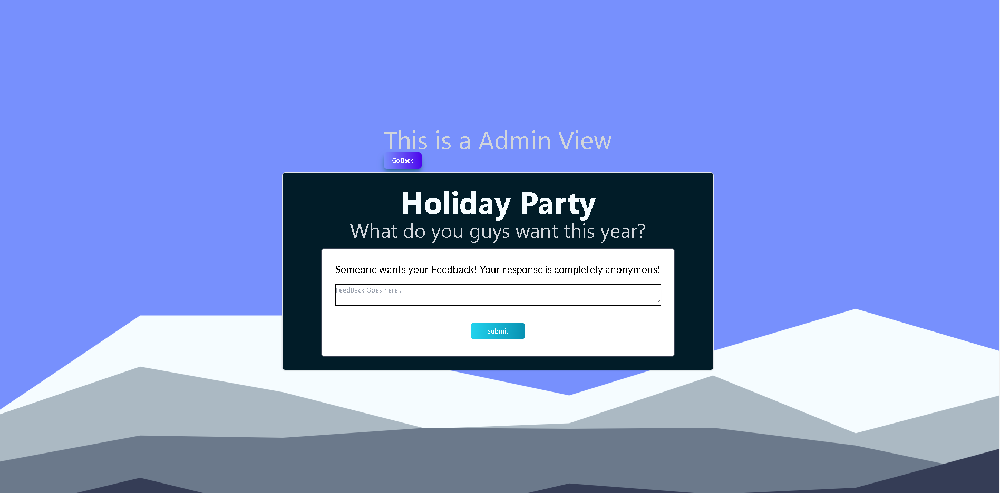

# Crowd Query

## Description

An intuitive and free form creation app for gathering anonymous feedback. Perfect for project administrators and anyone looking to effortlessly gather insights from specific groups. Make informed decisions and drive progress with ease, whether at work or in your community.

## Business Case

The Problem: A family member could not find a resource she could use to send out anonymous forms.
Resources are out there, but most were all paid services.
Google Forms is a free solution, but my sister still faced the issue that participants would shy away from submitting due to the Google Form showcasing their email if they were using Chrome.

Ex:

CrowdQuery works to solve that problem as it is completely anonymous and gets rid of the possibility of form recipients shying away from submitting feedback.

## Table of Contents

- [Features](#features)
- [Contributors](#contributors)
- [Technologies](#technologies)
- [License](#license)
- [UI](#ui)
- [LiveSite](#livesite)

## Features

After you have created an account, you will have access to the following features:

1. **Access to DashBoard**: Here you will be able to see your forms and most latest submissions.

2. **Create a Form**: You can create your anonymous CrowdQuery Form through the create form page where you can set a form title and description for your form.

3. **Admin Form View**: As an admin you can view the users view for when they access the form.

4. **Active Forms**: In this page you can select and view your active forms in more detail. All you have to is click on a form and you can then see all populated submissions.

Many more features to come!

## Contributors

This application was developed by the following contributors:

- [Oscar Leal](https://github.com/Oscarl214)

## UI

1. Sign Up Page
   

2. How It Works Page
   

3. DashBoard
   

4. Create Form Page
   

5. User View Form Page
   

## Technologies

This personal project was built using the following:

- MongoDB
- Express.js
- React
- Node.js
- GraphQL
- Apollo Server Express
- Bycript
- Mongoose
- TailwindCSS

## License

    This app is licensed under the MIT license.

## LiveSite

Coming soon.
